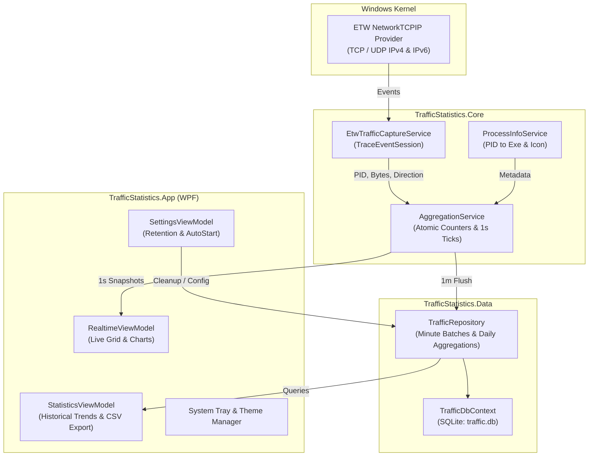

# TrafficStatistics

<p align="center">
  <strong>A modern, lightweight Windows desktop application for real-time per-process network traffic monitoring and historical statistics analysis.</strong>
</p>

<p align="center">
  
</p>

<p align="center">
  <a href="#features">Features</a> •
  <a href="#system-requirements">Requirements</a> •
  <a href="#architecture">Architecture</a> •
  <a href="#getting-started">Getting Started</a> •
  <a href="#configuration">Configuration</a> •
  <a href="#project-structure">Project Structure</a> •
  <a href="#license">License</a>
</p>

---

## Overview

**TrafficStatistics** is a high-performance network monitoring tool built with **.NET 9** and **WPF**. It leverages Event Tracing for Windows (**ETW**) to capture kernel-level network activities with minimal CPU overhead, providing real-time per-process bandwidth utilization, historical trend charts, and customizable data retention.

---

## Features

### ⚡ Real-Time Traffic Monitoring
- **Kernel-Level Packet Capture**: Utilizes ETW (`Microsoft.Diagnostics.Tracing.TraceEvent`) to capture TCP and UDP traffic (IPv4 & IPv6) at the Windows kernel level.
- **Per-Process Granularity**: Identifies PID, process name, executable path, and extracts application icons on the fly.
- **Live Speed Charts**: Smooth real-time upload and download throughput line charts powered by [LiveCharts2](https://github.com/beto-rodriguez/LiveCharts2).
- **Filtering & Multi-Column Sorting**: Quick search by process name or PID, with sorting by upload speed, download speed, total sent, or total received.

### 📊 Historical Analytics & Reporting
- **Multi-Granularity Aggregations**:
  - **Hourly**: Detailed breakdown over the last 24 hours.
  - **Daily**: Day-by-day trends for the past 30 days.
  - **Weekly**: Weekly summaries for the last 12 weeks.
  - **Monthly**: Monthly traffic totals for the last 12 months.
  - **Custom Range**: Custom start and end dates with adaptive resolution.
- **Top Consumers Ranking**: Identify bandwidth hogs and high-traffic applications.
- **CSV Data Export**: Export filtered statistics and process rankings to CSV for offline analysis and auditing.

### 🎨 Modern UI & System Tray
- **WPF MVVM Architecture**: Built with `CommunityToolkit.Mvvm` and dependency injection (`Microsoft.Extensions.Hosting`).
- **Dark & Light Themes**: Dynamic theme switching with styled custom title bar and controls.
- **System Tray Integration**: Runs quietly in the background via [Hardcodet NotifyIcon](https://github.com/hardcodet/wpf-notifyicon), with minimize-to-tray support.

### 💾 High-Performance Local Storage
- **Low Overhead Aggregation**: Atomic counters (`Interlocked`) buffer traffic in memory, flushing to SQLite in 1-minute batches.
- **SQLite Database**: Embedded local database managed with Entity Framework Core (`Microsoft.EntityFrameworkCore.Sqlite`).
- **Automatic Data Retention**: Configurable purge policies for high-resolution minute data and long-term daily summaries.

---

## System Requirements

- **Operating System**: Windows 10 / Windows 11 (x64 or ARM64).
- **Permissions**: **Administrator privileges** are required to launch ETW kernel network trace sessions (`KernelTraceEventParser.Keywords.NetworkTCPIP`).
- **Runtime**: [.NET 9.0 Desktop Runtime](https://dotnet.microsoft.com/download/dotnet/9.0) (unless using a self-contained build).

---

## Architecture



---

## Getting Started

### Prerequisites
- [.NET 9.0 SDK](https://dotnet.microsoft.com/download/dotnet/9.0) (version 9.0.100 or higher)
- Visual Studio 2022 (v17.12+) or JetBrains Rider or VS Code with C# Dev Kit

### 1. Clone the Repository
```bash
git clone https://github.com/your-username/TrafficStatistics.git
cd TrafficStatistics
```

### 2. Build the Solution
```bash
dotnet build TrafficStatistics.sln -c Release
```

### 3. Run Unit Tests
```bash
dotnet test
```

### 4. Publish Executable

#### Self-Contained Single Executable (No .NET installation required):
```bash
dotnet publish src/TrafficStatistics.App/TrafficStatistics.App.csproj \
  -c Release \
  -r win-x64 \
  --self-contained true \
  -p:PublishSingleFile=true \
  -p:IncludeNativeLibrariesForSelfExtract=true \
  -o ./publish/TrafficStatistics_Standalone
```

#### Framework-Dependent Build:
```bash
dotnet publish src/TrafficStatistics.App/TrafficStatistics.App.csproj \
  -c Release \
  -r win-x64 \
  --self-contained false \
  -o ./publish/TrafficStatistics_Portable
```

> **Note**: Always run the generated executable **as Administrator** to allow ETW kernel event capture.

---

## Project Structure

```text
TrafficStatistics/
├── src/
│   ├── TrafficStatistics.App/          # WPF GUI application
│   │   ├── Converters/                 # Value converters for XAML bindings
│   │   ├── Resources/                  # Icons, images, and theme dictionaries
│   │   ├── ViewModels/                 # MVVM view models (Realtime, Statistics, Settings)
│   │   ├── Views/                      # User control views (Realtime, Statistics, Settings)
│   │   ├── MainWindow.xaml             # Main window shell & navigation
│   │   └── App.xaml.cs                 # Application bootstrap & dependency injection
│   │
│   ├── TrafficStatistics.Core/         # Core business logic & ETW capture
│   │   ├── Helpers/                    # Byte formatting and timestamp helpers
│   │   ├── Models/                     # Domain models (Snapshot, Record, Process)
│   │   └── Services/                   # ETW capture, in-memory aggregation, process info
│   │
│   └── TrafficStatistics.Data/         # Persistence layer
│       ├── Repositories/               # Data access logic & aggregation queries
│       └── TrafficDbContext.cs         # SQLite Entity Framework Core context
│
├── tests/
│   ├── TrafficStatistics.Core.Tests/   # Unit tests for core helpers and formatting
│   └── TrafficStatistics.Data.Tests/   # Repository & database aggregation tests
│
├── TrafficStatistics.sln               # Solution file
├── .gitignore                          # Git ignore rules for .NET/WPF
└── .gitattributes                     # Line endings & binary file attributes
```

---

## Configuration

Settings are saved in `settings.json` located next to the executable:

```json
{
  "AutoStart": false,
  "MinuteDataRetentionDays": 7,
  "DailyDataRetentionDays": 365
}
```

| Parameter | Default | Description |
| :--- | :---: | :--- |
| `AutoStart` | `false` | Launch application automatically upon Windows user login. |
| `MinuteDataRetentionDays` | `7` | Number of days to retain 1-minute granular traffic data. |
| `DailyDataRetentionDays` | `365` | Number of days to retain aggregated daily traffic summaries. |

---

## License

This project is licensed under the [MIT License](LICENSE).
